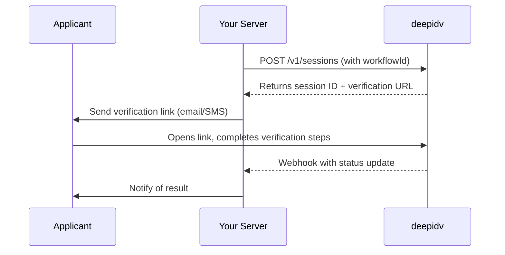

> Design multi-step verification flows by combining the exact services you need — then trigger them with a single API call or verification link.

export const VideoEmbed = ({ src, title = "Video" }) => (
  <div className="deepidv-video-embed">
    <iframe
      src={src}
      title={title}
      allow="accelerometer; autoplay; clipboard-write; encrypted-media; gyroscope; picture-in-picture"
      allowFullScreen
    />
  </div>
);

export const SectionHeader = ({
  label,
  title,
  description,
  align = "left",
}) => (
  <div
    className="deepidv-section-header"
    style={{
      textAlign: align,
      alignItems: align === "center" ? "center" : "flex-start",
    }}
  >
    {label && <p className="deepidv-section-label">{label}</p>}
    <h2 className="deepidv-section-title">{title}</h2>
    {description && <p className="deepidv-section-desc">{description}</p>}
  </div>
);

export const FeatureGrid = ({ cols = 3, children }) => (
  <div
    className="deepidv-feature-grid"
    style={{
      "--grid-cols": cols,
    }}
  >
    {children}
  </div>
);

export const FeatureCard = ({ icon, title, description }) => (
  <div className="deepidv-feature-card">
    {icon && (
      <div className="deepidv-feature-card-icon">
        <Icon icon={icon} size={20} />
      </div>
    )}
    <div className="deepidv-feature-card-content">
      <h3 className="deepidv-feature-card-title">{title}</h3>
      {description && (
        <p className="deepidv-feature-card-desc">{description}</p>
      )}
    </div>
  </div>
);

Workflows are the core of deepidv. Instead of configuring individual services every time, you build a reusable flow once — pick your services and reference that workflow by ID whenever you create a session. deepidv intelligently determines the optimal step order to minimize friction for the applicant.

<VideoEmbed
  src="https://www.youtube.com/embed/1nWVd0d3Du4?rel=0&playsinline=1"
  title="deepidv Workflow Builder"
/>

Head to [**app.deepidv.com/dashboard/workflow**](https://app.deepidv.com/dashboard/workflow) to create workflows and browse templates.

---

## How Workflows Work

A workflow defines:

- **Which services to run** — any combination of the services available on the platform
- **The total session cost** — the sum of all enabled services

When you create a session with a `workflowId`, deepidv automatically runs every check in that workflow. The platform intelligently orders the steps to reduce friction and maximize completion rates — results come back as a single session.

---

## Available Workflow Services

Drag and drop any of these into your workflow:

<FeatureGrid cols={3}>
  <FeatureCard icon="id-card" title="ID Verification" description="Scan and validate government-issued identity documents." />

  <FeatureCard icon="video" title="Face Liveness" description="Confirm the applicant is a real, live person." />

  <FeatureCard icon="cake" title="Age Estimation" description="Predict the applicant's age from a selfie." />

  <FeatureCard icon="shield-check" title="PEP & Sanctions" description="Screen against global sanctions and PEP lists." />

  <FeatureCard icon="newspaper" title="Adverse Media" description="Scan for negative press and legal mentions." />

  <FeatureCard icon="phone" title="Phone Verification" description="Live call with a spoken voice prompt to verify identity." />

  <FeatureCard icon="map-pin" title="Address Verification" description="AI-driven questions to confirm the applicant's location." />

  <FeatureCard icon="landmark" title="Bank Statement Sync" description="Pull bank statements via open banking." />

  <FeatureCard icon="chart-column" title="AI Bank Analysis" description="AI breakdown of income, spending, and affordability." />

  <FeatureCard icon="search" title="Title Search" description="Look up property title records and lien data." />

  <FeatureCard icon="file-lock" title="Document Upload" description="Collect documents with AI fraud detection." />

  <FeatureCard icon="camera" title="Custom Prompt Picture" description="Request a specific photo based on your prompt." />

  <FeatureCard icon="clipboard-list" title="Custom Forms" description="Add custom questions, fields, and file uploads." />

  <FeatureCard icon="map-location-dot" title="IP Jurisdiction" description="iGaming: block or allow by the applicant's country and datacenter IPs." />

  <FeatureCard icon="user-secret" title="VPN Detection" description="iGaming: detect VPN, Tor, and datacenter (anonymizer) connections." />

  <FeatureCard icon="shield-virus" title="Injection Detection" description="iGaming: catch injected media, virtual cameras, and emulators." />

  <FeatureCard icon="fingerprint" title="Anti-Cheat" description="iGaming: biometric duplicate detection, multi-accounting, and self-exclusion." />
  
  <FeatureCard icon="scan-face" title="Deepfake Detection" description="AI-native deepfake detection across images, video, audio, and documents." />

  <FeatureCard icon="nfc" title="NFC Verification" description="Read and verify the chip in electronic passports and ID cards." />

  <FeatureCard icon="accessibility" title="Accessibility Mode" description="Inclusive verification for applicants with disabilities or limited mobility." />

  <FeatureCard icon="key-round" title="Tokenized Age Verification" description="Issue a cryptographic age token without sharing the underlying ID." />

  <FeatureCard icon="scale" title="AML Status" description="Check against regulatory watchlists and financial crime databases." />

  <FeatureCard icon="phone-call" title="Background Verification" description="AI outbound reference calls that ask your questions and return structured answers." />

  <FeatureCard icon="file-search" title="Document Fraud Analysis" description="Forensic analysis of uploaded documents for tampering or forgery." />

  <FeatureCard icon="signature" title="E-Signature" description="Collect a legally binding electronic signature from the applicant." />

  <FeatureCard icon="send" title="Biometric Document Transfers" description="Send documents under a biometric lock only the verified recipient can open." />

  <FeatureCard icon="banknote" title="Open Banking + AI Analysis" description="Bank statement retrieval bundled with AI income and spending analysis." />

  <FeatureCard icon="house" title="Enhanced Title Search" description="Full title search covering liens, encumbrances, and ownership history." />

  <FeatureCard icon="building-2" title="KYB Check" description="Company registration, beneficial ownership, and corporate structure." />

  <FeatureCard icon="globe" title="KYB Global Enhanced" description="Cross-border KYB with ownership graphs and live registry validation." />

  <FeatureCard icon="credit-card" title="Credit Check (US)" description="US credit bureau report with score, trade lines, and payment history." />

  <FeatureCard icon="credit-card" title="Credit Check (CAN)" description="Canadian credit bureau report with score, trade lines, and history." />

  <FeatureCard icon="briefcase" title="Business Credit Check" description="Company credit score, payment trends, and risk assessment." />

  <FeatureCard icon="gavel" title="Background Check (US + Interpol)" description="US criminal records across federal, state, and county courts." />

  <FeatureCard icon="gavel" title="Background Check (CAN)" description="Canadian criminal record check through RCMP-accredited sources." />

  <FeatureCard icon="palette" title="White Label" description="Run the flow under your own brand — custom UI, logo, and domain." />

</FeatureGrid>

<Note>
  The four iGaming steps (`IP_JURISDICTION`, `VPN_DETECTION`, `INJECTION_DETECTION`, `ANTI_CHEAT`) are anti-fraud checks for gaming onboarding. See the [iGaming reference](/api-reference/igaming/overview) for how they work and [Create workflow → Step configuration](/api-reference/workflows/create-workflow#step-configuration) for every config field and default.
</Note>

<Tip>
  The total cost of a workflow session is the sum of each enabled service. Only add what you actually need — see [Pricing](/pricing) for per-service rates.
</Tip>

---

## Creating a Workflow

### From the Admin Console

1. Go to [**Workflows**](https://app.deepidv.com/dashboard/workflow) in the sidebar
2. Click **Create Workflow**
3. Pick a name and drag and drop the services you want to design your workflow
4. Save — deepidv handles the step ordering automatically

You can also start from a **template** — pre-configured workflows for common use cases that you can customize to fit your needs.

### Via the API

Manage workflows programmatically through the [Workflows API](/api-reference/workflows/list-workflows).

---

## Workflow Templates

Templates are pre-built starting points for the most common verification scenarios. Pick one in the Admin Console or the [Workflow Builder](/workflow-builder), tweak the services, and save.

| Template | Best for | Services | Defaults |
| --- | --- | --- | --- |
| **Basic KYC** | Simple identity verification workflow for basic know-your-customer requirements | ID Verification, Face Liveness, PEP/Sanctions, Adverse Media | Secondary ID required |
| **Fintech KYC/AML** | Full compliance workflow for financial technology platforms | Custom Form, ID Verification, PEP/Sanctions, Bank Statement, Document Upload | — |
| **Loan Origination Screening** | End-to-end loan application verification workflow | Custom Form, ID Verification, Credit Check, Bank Statement, E-Signature, Document Upload | — |
| **Vehicle Leasing** | Comprehensive verification for vehicle leasing applications | Custom Form, E-Signature, ID Verification, Bank Statement, Credit Check, Document Upload | — |
| **Crypto / VASP Onboarding** | AML-compliant onboarding for cryptocurrency and virtual asset platforms | Custom Form, ID Verification, Face Liveness, PEP/Sanctions, Adverse Media, Document Upload | — |
| **Insurance Underwriting** | Identity and risk verification for insurance policy applications | Custom Form, ID Verification, Document Upload, E-Signature | — |
| **New Hire Onboarding** | Comprehensive employee verification for new hires | Custom Form, ID Verification, Document Upload | — |
| **Contractor Verification** | Verify independent contractors and freelancers before engagement | Custom Form, ID Verification, Document Upload, E-Signature | — |
| **Vulnerable Sector Check (Canada Only)** | Enhanced screening for working with vulnerable populations | Custom Form, ID Verification | — |
| **Online Gaming (18+)** | Age verification workflow for online gaming platforms | ID Verification, Age Estimation, Custom Form | — |
| **Restricted Content** | Age estimation for restricted content access | Age Estimation | — |
| **Cannabis Dispensary** | Age and identity verification for cannabis retail compliance | ID Verification, Age Estimation, Custom Form | — |
| **Student Enrollment** | Identity and credential verification for higher education admissions | Custom Form, ID Verification, Document Upload | — |
| **Scholarship Application** | Verify applicant identity and financial eligibility for scholarships | Custom Form, ID Verification, Document Upload | — |
| **Exam Proctoring** | Verify test-taker identity before remote examinations | ID Verification, Face Liveness, Deepfake Detection | — |
| **Online Dating** | Trust and safety verification for dating and social platforms | Face Liveness, Deepfake Detection, Age Estimation, ID Verification | — |
| **Marketplace Seller** | Verify seller identity for online marketplaces and platforms | ID Verification, Custom Form, Document Upload, E-Signature | — |
| **Solicitor KYC** | Legal sector verification with biometric signatures | ID Verification, E-Signature, Document Upload | Biometric e-signature |
| **Realtor Pre-Screening** | Streamlined pre-qualification workflow for real estate transactions | Custom Form, Credit Check, E-Signature | Soft credit check only |
| **Notary Verification** | Remote online notarization identity verification workflow | ID Verification, Face Liveness, E-Signature, Document Upload | — |
| **Wallet Verification** | Verify identity and screen connected crypto wallets across chains | ID Verification, Face Liveness, Wallet Verification | — |
| **iGaming Compliance** | Player onboarding with jurisdiction, VPN, injection, and anti-cheat controls | ID Verification, Age Estimation, IP Jurisdiction, VPN Detection, Injection Detection, Anti-Cheat | — |

### Custom Workflow

Start from scratch and build exactly what your use case requires. Drag and drop any combination of services to design your workflow and save.

<Note>
  Every template can be fully customized after creation. Add or remove services at any time from the Admin Console. This list is generated from the builder catalog by `scripts/sync-workflow-builder.mjs`.
</Note>

---
## Using a Workflow

Once you've built a workflow, reference it by `workflowId` when creating sessions:

```bash
curl -X POST https://api.deepidv.com/v1/sessions \
  -H "Content-Type: application/json" \
  -H "x-api-key: YOUR_API_KEY" \
  -d '{
    "firstName": "Jane",
    "lastName": "Smith",
    "email": "jane.smith@example.com",
    "phone": "+14165557890",
    "workflowId": "wf_abc123"
  }'
```

<Note>
  Find your `workflowId` in the [Admin Console](https://app.deepidv.com/dashboard/workflow) under **Workflows**.
</Note>

---

## Integration Flow

Your backend creates a session with deepidv, receives a verification URL, and redirects the applicant. deepidv handles the entire user-facing experience and notifies your server when results are ready.



---

## Common Use Cases

| Use Case | Recommended Template | Key Services |
| --- | --- | --- |
| Standard user onboarding | Basic KYC | ID Verification, Face Liveness, PEP/Sanctions, Adverse Media |
| Mortgage or loan application | Loan Origination Screening | Custom Form, ID Verification, Credit Check, Bank Statement, E-Signature, Document Upload |
| Age-restricted product/content | Online Gaming (18+) or Restricted Content | Age Estimation, ID Verification, Custom Form |
| Fintech / crypto compliance | Fintech KYC/AML or Crypto / VASP Onboarding | Custom Form, ID Verification, PEP/Sanctions, Adverse Media, Document Upload |
| Remote exam or dating trust & safety | Exam Proctoring or Online Dating | ID Verification, Face Liveness, Deepfake Detection |
| Quick document collection | Custom Workflow | Document Upload, Custom Form |

---

## Managing Workflows

### List all workflows

```bash
curl -X GET https://api.deepidv.com/v1/workflows \
  -H "x-api-key: YOUR_API_KEY"
```

### Retrieve a specific workflow

```bash
curl -X GET https://api.deepidv.com/v1/workflows/wf_abc123 \
  -H "x-api-key: YOUR_API_KEY"
```

### View sessions for a workflow

```bash
curl -X GET "https://api.deepidv.com/v1/sessions?workflow_id=wf_abc123" \
  -H "x-api-key: YOUR_API_KEY"
```

See the full [Workflows API Reference](/api-reference/workflows/list-workflows) and [Sessions API Reference](/api-reference/sessions/list-sessions) for complete endpoint details.

---

## Getting Started

<CardGroup cols={2}>
  <Card title="Build Your First Workflow" icon="workflow" href="https://app.deepidv.com/dashboard/workflow">
    Open the workflow builder and start configuring.
  </Card>

  <Card title="Quick Start Guide" icon="rocket" href="/quickstart">
    End-to-end walkthrough from account setup to first session.
  </Card>
</CardGroup>
